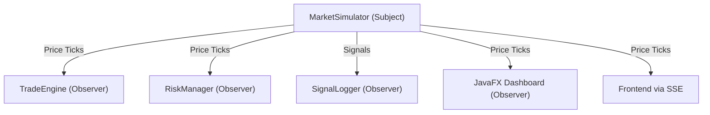

# Arthyantra — Comprehensive Study Guide

Welcome to the Arthyantra Study Guide! This document is designed specifically for academic review. It breaks down the system's architecture, the design patterns implemented, and provides a simple, plain-English explanation of what every core component does.

---

## 1. System Architecture Overview

Arthyantra is a full-stack Java application built without heavy external frameworks like Spring Boot. It uses Java's native `HttpServer` to serve HTTP requests and REST APIs, demonstrating a deep understanding of core networking, concurrency, and OOP principles.

### High-Level Flow
1. **Frontend (Browser/Desktop):** The user interacts with the UI. The JS file (`script.js`) or JavaFX View communicates with the backend.
2. **Backend Server (`MainServer.java`):** Routes incoming HTTP requests and manages the simulation state.
3. **Core Engines:** Handle the business logic (Simulation, Strategies, Risk, Backtesting).
4. **Persistence (`DBManager.java` & `FileManager.java`):** Saves and retrieves trade data.

---

## 2. Design Patterns Explained

To demonstrate advanced object-oriented design, Arthyantra heavily utilizes three primary design patterns: the **Observer Pattern**, the **Strategy Pattern**, and the **Modular View Pattern**.

### A. The Observer Pattern
**Problem:** When market prices update, multiple parts of the system need to know about it.
**Solution:** The Observer Pattern allows a "Subject" to broadcast updates to multiple listening "Observers".

### B. The Strategy Pattern
**Problem:** The platform supports multiple trading algorithms (Moving Average, RSI, etc.).
**Solution:** The Strategy Pattern encapsulates each algorithm into its own class, making them interchangeable at runtime.

### C. The Modular View Pattern (JavaFX)
**Problem:** Building complex desktop UIs in a single class makes the code unreadable.
**Solution:** Each screen (Dashboard, Strategies, etc.) is its own class, extending a layout container (like `VBox`). This promotes reusability and clean separation of UI logic.

---

## 3. Class-by-Class Breakdown

### The Core Server & App
*   **`MainServer.java`**: The brain. Manages port 8080 and all API endpoints.
*   **`MainApp.java`**: The entry point for the Desktop app. It launches the server on a background thread.

### Persistence (Data Storage)
*   **`DBManager.java`**: MySQL handler with automatic schema generation.
*   **`FileManager.java`**: The high-availability fallback that uses local `.txt` files.
*   **`Portfolio.java`**: The "Service" layer managing all trade operations.

### The Engines (Business Logic)
*   **`MarketSimulator.java`**: Threaded engine that generates live price fluctuations.
*   **`TradeEngine.java`**: The automated execution engine for signals.
*   **`RiskManager.java`**: Monitors stop-losses, take-profits, and portfolio drawdown.
*   **`BacktestEngine.java`**: Runs historical simulations to compare strategy performance.

---

## 4. Native Desktop Architecture (JavaFX)

Arthyantra features a native JavaFX desktop application with a **Single-JVM Shared Memory Architecture**.

*   **Shared State:** Both the Desktop UI and the Web UI access the exact same `Portfolio` and `MarketSimulator` instances in memory.
*   **Consistency:** If you execute a trade in the JavaFX app, it appears instantly in the Web browser, and vice-versa.
*   **Concurrency:** The server runs on a background thread, while the JavaFX UI thread stays responsive for smooth animations.

### JavaFX View Breakdown
*   **`DashboardView.java`**: Real-time stats and trade execution form.
*   **`StrategiesView.java`**: Live configuration of algorithms and signal auditing.
*   **`BacktestView.java`**: Historical simulator interface.
*   **`RiskView.java`**: Global risk limit management and status monitoring.

---

## 5. Potential Interview/Viva Questions & Answers

**Q: Why didn't you use Spring Boot?**
*A: To demonstrate a strong foundational understanding of Java. Building the HTTP server and API routing from scratch shows I understand how web requests work under the hood.*

**Q: Explain how your Real-Time updates work.**
*A: I used Server-Sent Events (SSE) for the web and the Observer Pattern for the desktop. SSE is a unidirectional stream that is lighter and faster than WebSockets for price updates.*

**Q: What happens if the database crashes?**
*A: The system implements a robust fallback mechanism. If MySQL fails, all operations are routed to `FileManager`, ensuring zero data loss.*

**Q: Why implement both a Web and a Desktop interface?**
*A: To showcase a unified "Single Source of Truth" backend. It proves the core logic is presentation-agnostic and can support multiple high-concurrency interfaces.*
