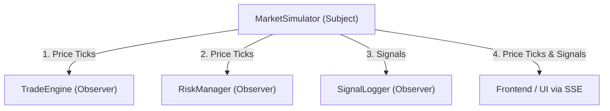
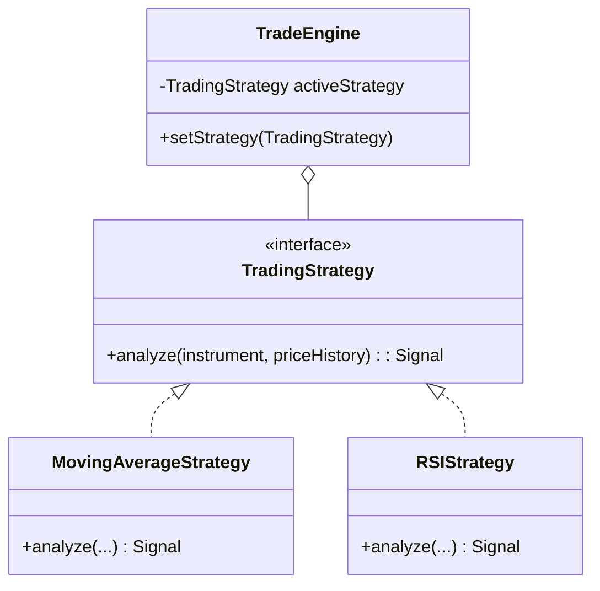

# Arthyantra — Comprehensive Study Guide

Welcome to the Arthyantra Study Guide! This document is designed specifically for academic review. It breaks down the system's architecture, the design patterns implemented, and provides a simple, plain-English explanation of what every core component does.

---

## 1. System Architecture Overview

Arthyantra is a full-stack Java application built without heavy external frameworks like Spring Boot. It uses Java's native `HttpServer` to serve HTTP requests and REST APIs, demonstrating a deep understanding of core networking, concurrency, and OOP principles.

### High-Level Flow
1. **Frontend (Browser):** The user interacts with the UI. The JS file (`script.js`) makes HTTP REST calls for actions (like adding a trade) and opens a persistent Server-Sent Events (SSE) connection to receive live market updates.
2. **Backend Server (`MainServer.java`):** Routes incoming HTTP requests. It acts as the Controller in an MVC-like architecture.
3. **Core Engines:** Handle the business logic (Simulation, Strategies, Risk, Backtesting).
4. **Persistence (`DBManager.java` & `FileManager.java`):** Saves and retrieves trade data.

---

## 2. Design Patterns Explained

To demonstrate advanced object-oriented design, Arthyantra heavily utilizes two primary design patterns: the **Observer Pattern** and the **Strategy Pattern**.

### A. The Observer Pattern
**Problem:** When market prices update (every 2 seconds), multiple parts of the system need to know about it. The UI needs to update, the auto-trader needs to check if it should buy/sell, and the risk manager needs to check if a stop-loss was hit.
**Solution:** The Observer Pattern allows a "Subject" to broadcast updates to multiple listening "Observers" without the Subject needing to know exactly who is listening.

*   **`MarketSimulator` (Subject):** Generates random market data. When it creates a new price, it loops through its list of registered observers and calls their `onPriceUpdate()` method.
*   **Observers:** `TradeEngine`, `RiskManager`, and `SignalLogger` all implement the `MarketObserver` interface. They "listen" to the simulator and react when data arrives.

### B. The Strategy Pattern
**Problem:** The platform supports multiple trading algorithms (Moving Average, RSI, etc.). If we hardcode them into the engine with massive `if/else` statements, the code becomes impossible to maintain.
**Solution:** The Strategy Pattern defines a family of algorithms, encapsulates each one into its own class, and makes them interchangeable.

*   **`TradingStrategy` (Interface):** Dictates that all strategies must have an `analyze()` method returning a `Signal`.
*   **`MovingAverageStrategy` & `RSIStrategy` (Concrete Strategies):** The actual math/logic for the specific trading rules.
*   **Context:** `TradeEngine` holds a reference to the active `TradingStrategy`. We can swap the strategy at runtime without restarting the server!

---

## 3. Class-by-Class Breakdown

Here is a simple explanation of what each Java file does:

### The Core Server
*   **`MainServer.java`**
    *   *What it does:* The brain of the application. It boots up the server on port 8080.
    *   *Key Functions:* Contains multiple `HttpHandler` classes that act as API endpoints (e.g., `/add` handles new trades, `/stream` handles the live SSE connection).

### Persistence (Data Storage)
*   **`DBManager.java`**
    *   *What it does:* Manages the connection to the MySQL database. It automatically creates the `forex` database and the `trades` table if they don't exist.
*   **`FileManager.java`**
    *   *What it does:* A safety net! If MySQL isn't installed or is turned off, this class takes over and saves your trades to a local text file (`data/trades.txt`) so the app never crashes.
*   **`Portfolio.java`**
    *   *What it does:* The "Service" layer. When the user wants to buy or sell, `MainServer` tells `Portfolio`, and `Portfolio` talks to the `DBManager` or `FileManager` to actually save the data.

### The Models
*   **`Trade.java`**
    *   *What it does:* A simple object (POJO) that holds the data for a single trade (ID, Instrument, Quantity, Price, Stop-Loss, Take-Profit).
*   **`Signal.java`**
    *   *What it does:* An object representing a system recommendation to `BUY`, `SELL`, or `HOLD`. It includes the confidence level and the reason for the signal.

### The Engines (Business Logic)
*   **`MarketSimulator.java`**
    *   *What it does:* Runs a background thread that generates simulated price fluctuations every 2 seconds. It notifies all observers when prices change.
*   **`TradeEngine.java`**
    *   *What it does:* If "Auto-Trade" is turned on, this engine listens to the `MarketSimulator`. It asks the active `TradingStrategy` if it should buy or sell. If the strategy returns a high-confidence signal, the engine executes the trade automatically.
*   **`RiskManager.java`**
    *   *What it does:* Protects the portfolio. It watches live prices and compares them to the user's open trades. If a price drops below a trade's Stop-Loss, it automatically sells the position to prevent further losses. It also tracks the total portfolio "Drawdown" (how much money you've lost from your highest peak).
*   **`BacktestEngine.java`**
    *   *What it does:* Time travel! It generates thousands of historical data points instantly, runs multiple strategies against that historical data, and compares them to see which strategy would have made the most money (P&L), had the best Win Rate, and the best Sharpe Ratio.

---

## 4. How the Frontend Works

The frontend uses Vanilla HTML, CSS, and JS to maintain lightweight performance.

*   **`index.html`:** The skeleton. It uses a modern tabbed layout (Dashboard, Strategies, Backtest, Risk).
*   **`style.css`:** Implements a "Glassmorphism" design system. It uses CSS variables for theming (emerald greens for profit/buy, rose reds for loss/sell) and includes keyframe animations for flashing numbers when prices update.
*   **`script.js`:** The muscle.
    *   Uses the `fetch()` API to talk to `MainServer` (e.g., loading portfolio stats).
    *   Uses the `EventSource` API to open a persistent connection to the `/stream` endpoint. When the server pushes a new price, the JavaScript instantly updates the DOM without needing to refresh the page.

---

## 5. Potential Interview/Viva Questions & Answers

**Q: Why didn't you use Spring Boot?**
*A: To demonstrate a strong foundational understanding of Java. Building the HTTP server and API routing from scratch using `com.sun.net.httpserver` shows I understand how web requests work under the hood, rather than just relying on annotations.*

**Q: Explain how your Real-Time updates work.**
*A: I used Server-Sent Events (SSE). Unlike WebSockets which are bi-directional, SSE is a unidirectional stream from the server to the client. Since the client only needs to read market prices and doesn't need to send streaming data back, SSE is much simpler, lighter, and operates natively over standard HTTP.*

**Q: What happens if the database crashes?**
*A: The system implements a robust fallback mechanism. If `DBManager` fails to connect via JDBC, `Portfolio` catches the exception and routes all CRUD operations to `FileManager`, which stores data in a flat text file. This ensures high availability.*

**Q: Why use the Observer Pattern for the Market Simulator?**
*A: Loose coupling. The `MarketSimulator` shouldn't care who is listening to it. By using the Observer pattern, I was able to plug in the UI streamer, the Auto-Trader, and the Risk Manager independently without modifying the Simulator's core code.*
